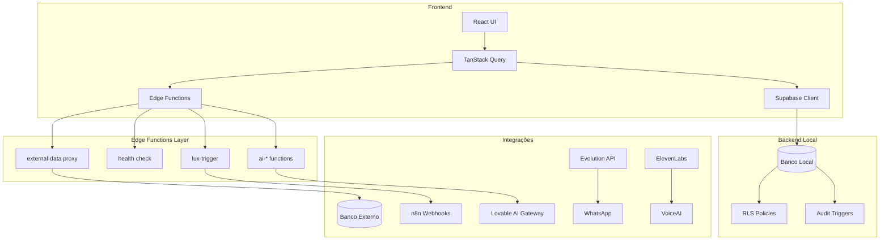

# Arquitetura do SINGU CRM

> Documento de referência para desenvolvedores. Última atualização: Abril 2026.

## Visão Geral

O SINGU é um CRM de vendas inteligente com análise comportamental (DISC, IE, Vieses Cognitivos), pipeline Kanban, gamificação e integrações externas (WhatsApp, Email, Voice AI).

## Stack Tecnológico

| Camada | Tecnologia |
|--------|-----------|
| Frontend | React 18, TypeScript 5, Vite 5 |
| Estilização | Tailwind CSS v3, shadcn/ui |
| Estado Servidor | TanStack Query (exclusivo) |
| Estado Local | Zustand (sidebar), URL params (filtros) |
| Backend | Lovable Cloud (Supabase) |
| Edge Functions | Deno runtime, Zod validation |
| Banco Externo | Supabase remoto via RPC bridge |
| Auth | Supabase Auth + Google OAuth |
| Mapas | Leaflet 4.2.1 (pinned) |

## Diagrama de Arquitetura



## Fluxo de Dados

### 1. Dados Locais (CRUD direto)
```
UI Component → useQuery/useMutation → Supabase Client → Banco Local (com RLS)
```

### 2. Dados Externos (via proxy)
```
UI Component → useQuery → Edge Function 'external-data' → Banco Externo (RPC)
```
O proxy `external-data` é o único ponto de acesso ao banco externo. Ele valida tabelas, aplica filtros e roteia RPCs.

### 3. Análises Automáticas
```
Nova Interação (>100 chars) → Background triggers → Edge Functions paralelas:
  ├── analyze-interaction (DISC)
  ├── analyze-sentiment (IE)
  └── detect-cognitive-biases
```

## Padrões Obrigatórios

### TanStack Query (Estado do Servidor)
- **NUNCA** usar `useEffect` para fetch de dados
- `staleTime`: 5-30 minutos dependendo da entidade
- `fetchWithFallback` para dados externos com circuit breaker

### Resiliência
- `Array.isArray()` antes de qualquer iteração
- `ExternalDataCard` para estados de loading/error/empty
- Circuit breaker com backoff exponencial para integrações

### Segurança
- RLS em todas as tabelas com `user_id`
- RBAC via `has_role()` function (SECURITY DEFINER)
- Rate limiting in-memory em Edge Functions
- Audit trail via triggers no banco

### Qualidade de Código
- Máximo 400 linhas por arquivo
- Zero `any` types
- Zero `dangerouslySetInnerHTML`
- Componentes memoizados em grids de alto volume

## Decisões de Design e Trade-offs

| Decisão | Motivo | Trade-off |
|---------|--------|-----------|
| TanStack Query exclusivo | Consistência, cache automático, dedup | Curva de aprendizado para novos devs |
| Proxy único para DB externo | Segurança, controle centralizado | Latência adicional (~100ms) |
| RLS em vez de middleware | Proteção na camada de dados | Complexidade em queries cross-user |
| Leaflet 4.2.1 fixo | Compat React 18 | Sem features novas do Leaflet |
| Zustand para sidebar | Leve, sem boilerplate | Mais uma lib de estado |
| URL params para filtros | Compartilhável, persistente | Verbosidade na URL |

## Módulos Principais

| Módulo | Rota | Responsabilidade |
|--------|------|------------------|
| Dashboard | `/` | KPIs executivos, alertas, atividade recente |
| Contatos | `/contatos` | CRUD + DISC + IE + cadência |
| Empresas | `/empresas` | CRUD + mapa + hierarquia cooperativa |
| Pipeline | `/pipeline` | Kanban de oportunidades com forecast |
| Interações | `/interacoes` | Timeline unificada (email, WhatsApp, voz) |
| Analytics | `/analytics` | Gráficos, saúde de dados, adoção |
| Admin | `/admin/*` | Telemetria, schema drift, secrets, audit |

## Módulos Proibidos

- **Produtos**: gerenciado pelo ERP externo
- **Propostas**: gerenciado pelo ERP externo

## Estrutura de Diretórios

```
src/
├── components/       # Componentes reutilizáveis
│   ├── admin/        # Dashboard e ferramentas admin
│   ├── contacts/     # UI de contatos
│   ├── companies/    # UI de empresas
│   ├── pipeline/     # Kanban e deals
│   ├── feedback/     # ErrorBoundary, loading states
│   └── ui/           # shadcn/ui primitives
├── hooks/            # Custom hooks (useContacts, useAuth, etc.)
├── lib/              # Utilitários, helpers, logger
├── integrations/     # Supabase client e types (auto-gerado)
├── pages/            # Componentes de página (1 por rota)
└── contexts/         # React contexts (NavigationStack, etc.)

supabase/
├── functions/        # Edge Functions (Deno)
├── migrations/       # SQL migrations (auto-gerado)
└── config.toml       # Configuração do projeto
```
