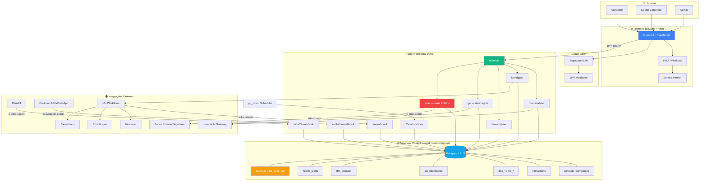
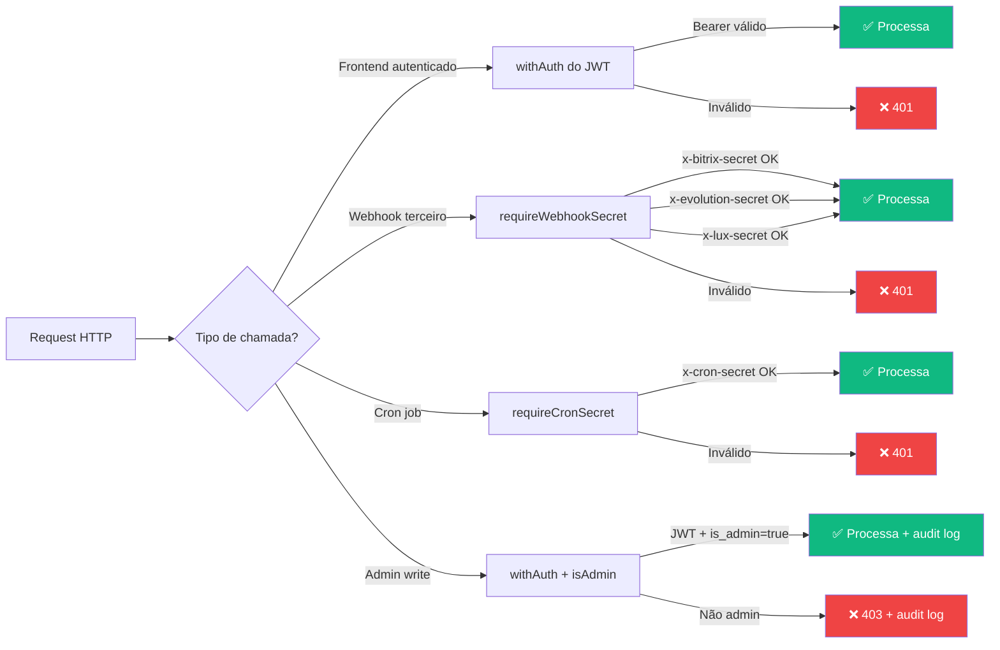
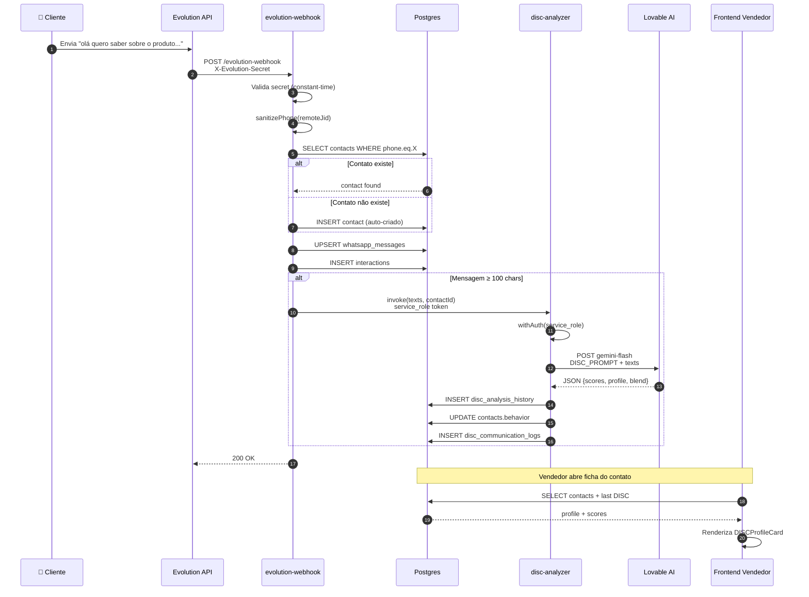
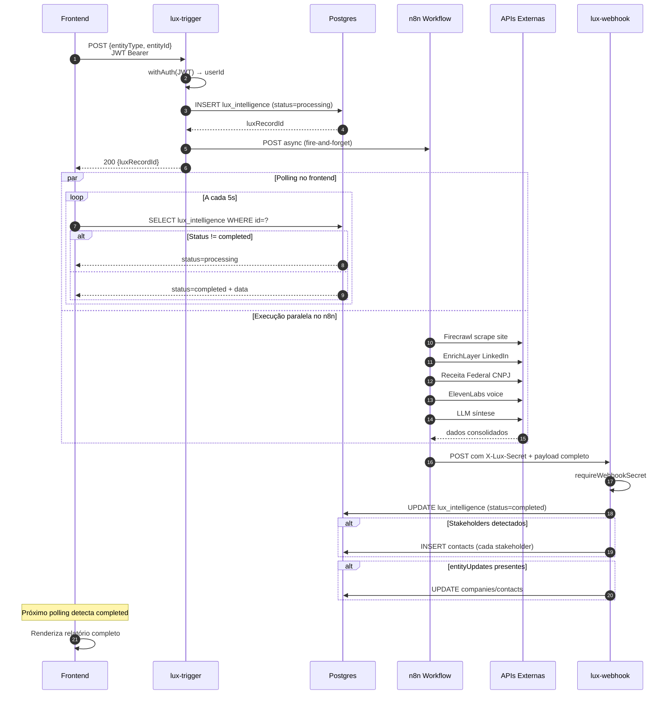
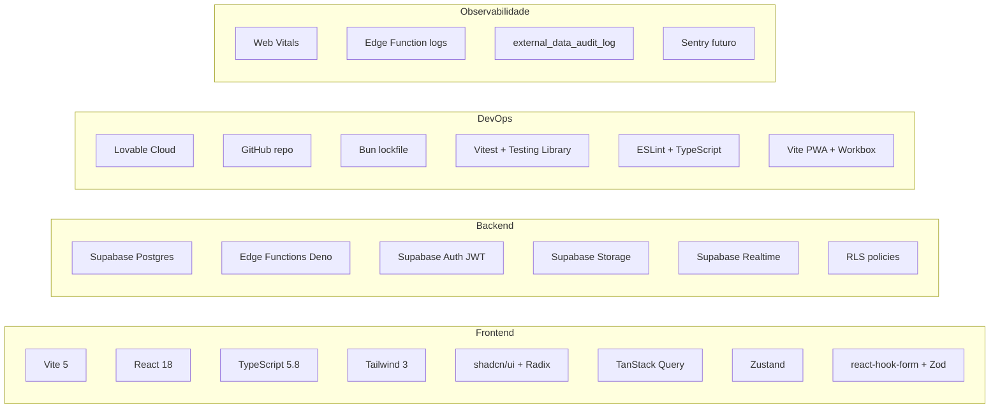
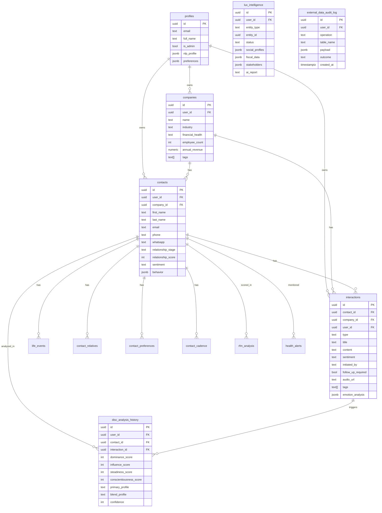
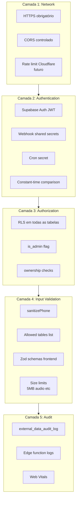

# 🏗️ SINGU CRM — Arquitetura Completa

## 📐 Visão geral



---

## 🔒 Modelo de autenticação por edge function



---

## 🔁 Fluxo: Mensagem WhatsApp → Análise DISC



---

## 🎯 Fluxo: Lux Intelligence (assíncrono)



---

## 📊 Stack tecnológica



---

## 🗂️ Estrutura de pastas

```
singu/
├── .env.example                 ← template de variáveis
├── .gitignore                   ← .env bloqueado
├── README.md                    ← documentação principal
├── docs/
│   ├── POPs_PROCESSOS.md        ← procedimentos operacionais
│   ├── ARQUITETURA.md           ← este arquivo
│   ├── SECURITY.md              ← política de segurança
│   ├── KPIs_GESTAO.md           ← dashboards e métricas
│   └── SCHEMA.md                ← documentação do banco
├── src/
│   ├── App.tsx                  ← rotas + providers
│   ├── main.tsx
│   ├── components/              ← UI components
│   │   ├── disc/                ← módulo DISC
│   │   ├── nlp/                 ← módulo NLP
│   │   ├── neuro/               ← Neuromarketing
│   │   ├── carnegie/            ← Carnegie
│   │   ├── triggers/            ← Trigger Bundles
│   │   └── ui/                  ← shadcn/ui base
│   ├── pages/                   ← rotas
│   ├── hooks/                   ← lógica de negócio
│   ├── lib/
│   │   └── externalData.ts      ← cliente external-data
│   ├── integrations/
│   │   └── supabase/
│   │       ├── client.ts        ← cliente Supabase
│   │       └── types.ts         ← tipos gerados (117KB)
│   ├── stores/                  ← Zustand
│   └── __tests__/               ← Vitest tests
├── supabase/
│   ├── config.toml              ← config edge functions
│   ├── functions/
│   │   ├── _shared/
│   │   │   └── auth.ts          ← helpers de auth (NOVO)
│   │   ├── disc-analyzer/
│   │   ├── lux-trigger/         ← já tinha auth manual
│   │   ├── lux-webhook/
│   │   ├── bitrix24-webhook/
│   │   ├── evolution-webhook/
│   │   ├── external-data/       ← com admin gate (NOVO)
│   │   └── ... (28 functions total)
│   └── migrations/              ← ~50 SQL migrations
└── public/
    └── pwa-*.png
```

---

## 🧬 Modelo de dados — entidades principais



---

## 🛡️ Camadas de segurança



---

## 📦 Edge Functions — categorização

| Categoria | Funções | Auth model |
|---|---|---|
| **Frontend chamadas** | disc-analyzer, voice-to-text, ai-writing-assistant, generate-insights, generate-offer-suggestions, suggest-next-action, enrichlayer-linkedin, firecrawl-scrape, enrich-contacts, social-*, rfm-analyzer, elevenlabs-*, voice-agent, send-push-notification, external-data | `withAuth` (JWT) |
| **Webhooks de terceiros** | bitrix24-webhook, evolution-webhook, evolution-api, lux-webhook | `requireWebhookSecret` |
| **Triggers do user** | lux-trigger | `withAuth` (manual) |
| **Crons** | check-notifications, check-health-alerts, client-notifications, template-success-notifications, smart-reminders, weekly-digest | `requireCronSecret` |

**Total: 28 edge functions**

---

**Versão:** 1.0 — 2026-04-09
